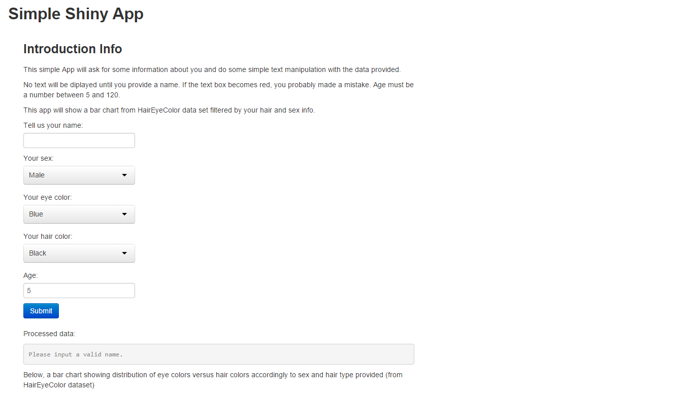

## 1. Introduction

The Simple Shiny App is a Shiny App published in shinyapps.io.

The application collects some information about the user, does some processing and
presents a multi bar chart filtered by the data provided by the user.

The application is accessible at: https://jean-rodrigues.shinyapps.io/simpleShinyApp/

---
## 2. About the Application

The application makes use of the dataset named HairEyeColor, avaiable with R.

When the user provides its hair color and sex information, the application exhibits some info
about the user and its age and presents a chart filtering the dataset by the sex and hair data provided.
```{r setup, message = F, echo = F, cache = F}
require(rCharts)
require(base64enc)
knitr::opts_chunk$set(comment = NA, results = 'asis', tidy = F, message = T)
```

```{r chart1, echo=F}
knitr::opts_chunk$set(comment = NA, results = 'asis', tidy = F, message = T)
#options(rcharts.mode = 'iframesrc', cdn = TRUE)
n1 <- nPlot(Freq ~ Hair, group = "Eye", data = subset(data.frame(HairEyeColor), Sex=="Male"), type = "multiBarChart", width = 800)
n1$chart(stacked = F)
n1$xAxis(axisLabel = "Hair for Male")
n1$yAxis(axisLabel = "Freq", width = 40)
#n1$save('Figure_1_1.html')
#n1$print("chart1")
```
<iframe src ='Figure_1_1.html', width = "860px", height = "450px"></iframe>

--- 
## 3. Screenshots

<!-- Limit image width and height -->
<style type='text/css'>
img {
    max-height: 560px;
    max-width: 964px;
}
</style>

<!-- Center image on slide -->
<script src="http://ajax.aspnetcdn.com/ajax/jQuery/jquery-1.7.min.js"></script>
<script type='text/javascript'>
$(function() {
    $("p:has(img)").addClass('centered');
});
</script>
<div style='text-align: center; border: 2px solid;'>
    
</div>


---
## 4. Conclusion

This simple application and this presentation were aimed at achieving the following:
- Understanding of slidify customization;
- Developing simple Shiny apps and embedding rCharts;
- Developing interaction with the user and understanding of reactive functions in Shiny;
- Publishing Shiny apps and Slidify presentations.

